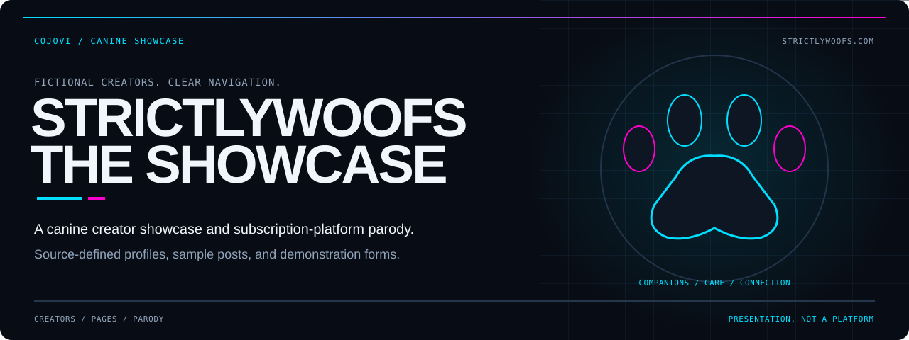
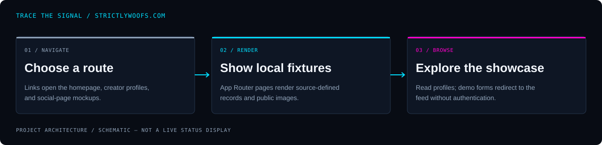

<!-- COJOVI / SIGNAL — StrictlyWoofs.com project edition. Keep readme-assets/ with this file. -->
<a name="top"></a>

<p align="center">
  
</p>

<h1 align="center">StrictlyWoofs.com</h1>

<p align="center">
  <strong>Browse the pack. Meet the characters. Enjoy the parody.</strong><br>
  A source-based Next.js showcase for fictional canine creators and subscription-style pages.
</p>

<p align="center">
  
</p>

<p align="center">
  <a href="#overview">Overview</a> ·
  <a href="#architecture">Architecture</a> ·
  <a href="#quickstart">Quickstart</a> ·
  <a href="#configuration">Content</a> ·
  <a href="#validation">Validation</a> ·
  <a href="#security">Boundaries</a>
</p>

---

<a name="overview"></a>
## `> meet_the_showcase`

**StrictlyWoofs.com is a canine-themed parody of subscription-content platforms.** A creator directory, sample feed, pricing cards, and social-page mockups demonstrate the site's look and navigation without implementing a paid service.

This README describes **[cojovi/StrictlyWoofs.com](https://github.com/cojovi/StrictlyWoofs.com)** only. It is not the interactive `Strictly_Woofs` implementation: this repository uses root-level `app/` routes and mostly static page content.

| Discover | Browse | Preview |
| :--- | :--- | :--- |
| Open featured creators and source-defined profile pages. | Explore sample feed posts and a fictional message-thread list. | See pricing tiers, live/scheduled stream cards, and demonstration account forms. |

> [!IMPORTANT]
> **This is a presentation demo, not an account, streaming, messaging, or payment platform.** Login and signup only redirect to `/feed`. Follow and stream buttons have no implemented actions; prices and viewer/follower counts are fixture content.

<a name="architecture"></a>
## `> trace_the_pages`

<p align="center">
  
</p>

```text
Route request / navigation
           ↓
Next.js App Router + source-defined content
├─ home, feed, live, and message pages
├─ creator lookup + generated profile parameters
└─ client-side login / signup forms
           ↓
Rendered showcase pages; form submission → /feed
```

[app/page.tsx](app/page.tsx) defines the homepage and pricing links. The [creator route](app/creator/%5Busername%5D/page.tsx) looks up a local object, generates parameters for seven creators, and calls `notFound()` for unknown names. No database lookup is involved.

The login and signup pages are client components whose submit handlers prevent form submission and change `window.location.href`. Other pages are predominantly server-rendered presentation components. No API routes, server actions, authentication provider, payment integration, or message transport are tracked.

Local media lives in [public/](public/). [layout.tsx](app/layout.tsx) uses `next/font/google` for Geist fonts, so a future build may require font downloads. This source audit does not establish offline build support.

<a name="quickstart"></a>
## `> open_the_workbench`

**Prerequisites:** Git, npm, and a compatible Node.js installation. The locked Next.js package declares `^18.18.0 || ^19.8.0 || >=20.0.0`; the root manifest does not pin a Node engine. Choose a maintained compatible release.

### 1. Clone the actual source

```bash
git clone --branch main https://github.com/cojovi/StrictlyWoofs.com.git
cd StrictlyWoofs.com
```

### 2. Review before previewing

Review the fixture copy, form behavior, and local media for your intended audience and permissions. Use dummy information only; the forms do not create accounts or protect anything.

This revision includes editable source under `app/`. Despite historical README notes and tracked build metadata, you do **not** need a separate original-source repository to modify it.

### 3. Install and run locally

```bash
npm ci
npm run dev -- --hostname 127.0.0.1
```

Open **http://127.0.0.1:3000**, or the port printed by Next.js. The explicit hostname keeps the development listener on loopback.

No required application environment variables or service credentials were found in the reviewed source. There is no backend provisioning step to unlock the mock features.

<a name="usage"></a>
## `> browse_the_routes`

| Route | Implemented behavior |
| :--- | :--- |
| `/` | Featured creators, promotional content, and three pricing cards. |
| `/creator/[username]` | Local profile data, specialties, and recent-post thumbnails. |
| `/feed` | Fixed sample posts; not a personalized or updating feed. |
| `/live` | Live/scheduled stream cards; buttons do not open a stream. |
| `/messages` | Static thread previews and an upgrade link; no conversation composer. |
| `/login` | Required form fields followed by navigation to the feed. |
| `/signup` | Required fields and a terms checkbox followed by navigation to the feed. |

Pricing links pass `?plan=basic`, `?plan=premium`, or `?plan=vip` to signup. The signup page does not consume those parameters, compare the two password fields, or create a subscription.

The homepage advertises six creators while the profile data supports seven. The profile page's Follow button is presentation only; its Message link opens the generic message list, not a creator-specific chat.

Footer and signup links reference `/help`, `/contact`, `/terms`, `/privacy`, and `/cookies`, but those routes are not present. They are unfinished destinations, not published policies.

<a name="configuration"></a>
## `> curate_the_content`

| Change | Edit |
| :--- | :--- |
| Homepage creators, pricing, footer links | [app/page.tsx](app/page.tsx) |
| Profile records and static parameters | [Creator page](app/creator/%5Busername%5D/page.tsx) |
| Sample feed posts | [app/feed/page.tsx](app/feed/page.tsx) |
| Stream labels and scheduled cards | [app/live/page.tsx](app/live/page.tsx) |
| Message-thread previews | [app/messages/page.tsx](app/messages/page.tsx) |
| Demonstration forms | [Login](app/login/page.tsx) and [signup](app/signup/page.tsx) |
| Page metadata and fonts | [app/layout.tsx](app/layout.tsx) |
| Shared styling | [app/globals.css](app/globals.css) and [tailwind.config.ts](tailwind.config.ts) |
| Images and logos | [public/](public/) |

Content is embedded in page modules rather than maintained in a CMS. Keep image references and creator identifiers aligned across the homepage, profile object, feed, and message list when changing a character.

The npm package is named `strictlywoofs`. [tsconfig.json](tsconfig.json) maps `@/*` to the repository root. [next.config.js](next.config.js) configures images but does **not** enable static export.

<a name="validation"></a>
## `> check_the_showcase`

For a maintainer's controlled environment, the package provides:

```bash
npm run lint
npm run build
npm run start -- --hostname 127.0.0.1
```

`start` is the Next.js production server and requires a successful build. These commands describe available scripts, not verified passing results. The manifest pins Next.js **15.4.10**, rather than the older version described in the previous README.

**Application builds and tests were not run for this documentation work.** There is no tracked automated test suite, test script, or GitHub Actions workflow.

- [ ] Review source copy and media permissions for the intended audience.
- [ ] Check all featured profile links and unknown-creator handling.
- [ ] Verify image loading, font availability, keyboard navigation, and mobile layouts.
- [ ] Confirm that form submissions are clearly identified as demonstrations.
- [ ] Check pricing query parameters without treating them as active subscriptions.
- [ ] Replace or remove missing support and legal destinations.
- [ ] Run lint and build before attempting a local production-server preview.
- [ ] Decide whether to implement or visibly disable nonfunctional controls.

### Do not serve the repository root as a website

The legacy `serve` script is `http-server -p 3000`, but `http-server` is not declared in the manifest or npm lockfile. It is not a self-contained startup path, and serving the checkout root could expose source and future local files.

Tracked build manifests are not proof of a complete or deployable build. Use the Next.js source/build workflow above; no deployment configuration or automated publishing workflow is supplied in this revision.

<a name="source-map"></a>
## `> explore_the_source`

| Path | Responsibility |
| :--- | :--- |
| [app/](app/) | Editable route source, shared layout, and styles. |
| [public/](public/) | Media files referenced by `next/image`. |
| [package.json](package.json) | Next.js 15.4.10, React 18, scripts, and dependencies. |
| [package-lock.json](package-lock.json) | npm dependency resolution. |
| [next.config.js](next.config.js) | Next.js image configuration. |
| [postcss.config.js](postcss.config.js) | Tailwind and Autoprefixer configuration. |
| [tsconfig.json](tsconfig.json) | TypeScript options and root-based import alias. |

<a name="security"></a>
## `> name_the_boundary`

- **Never use real passwords here.** Browser-required fields are not authentication; no account is created and no access control follows a redirect.
- **No money changes hands.** The advertised prices and upgrade links are parody presentation, not checkout or billing functionality.
- **No real conversations or broadcasts exist.** Message previews and “live” status are fixture content.
- **Review media independently.** The original README called the site family-friendly, but this source-only audit did not inspect media and cannot certify suitability or licensing.
- **Protect future configuration.** The current ignore file covers `.env*.local`, not every possible `.env` filename. Establish explicit ignore rules before adding secrets to any extension of the project.

### Attribution and license

Maintained in [cojovi/StrictlyWoofs.com](https://github.com/cojovi/StrictlyWoofs.com). GitHub metadata does not identify it as a fork. Next.js, React, Tailwind, and other dependencies remain separate projects with their own notices.

**The original README states “All rights reserved.” No root license file was found.** Preserve that restriction; public source availability does not grant an open-source license or rights to redistribute the media. The site identifies itself as a parody for entertainment purposes.

---

<p align="center">
  
</p>

<p align="center">
  <strong>Fictional creators. Clear navigation. No hidden promises.</strong><br>
  <sub>A <a href="https://github.com/cojovi">Cody / cojovi</a> project · <a href="https://cojovi.com">cojovi.com</a><br>
  StrictlyWoofs.com · Presented in COJOVI / SIGNAL.</sub>
</p>

<p align="center"><a href="#top">↑ Back to the signal</a></p>
